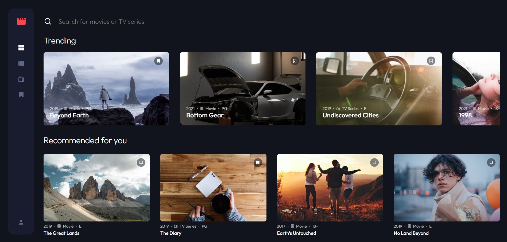

# Frontend Mentor - Entertainment web app solution

This repository contains my solution to the Entertainment web app challenge hosted on Frontend Mentor [Entertainment web app challenge on Frontend Mentor](https://www.frontendmentor.io/challenges/entertainment-web-app-J-UhgAW1X). This is my first attempt at Angular, and I wanted to level up my skills in Angular and Typescript, especially after landing my first proper developer job (non CRO / A/B testing role).

## Table of contents

- [Overview](#overview)
  - [The challenge](#the-challenge)
  - [How to use](#how-to-use)
  - [Screenshot](#screenshot)
  - [Link](#link)
- [My process](#my-process)
  - [Built with](#built-with)
  - [Continued development](#continued-development)
- [Author](#author)

## Overview

### The challenge

Users should be able to:

- View the optimal layout for the app depending on their device's screen size
- See hover states for all interactive elements on the page
- Navigate between Home, Movies, TV Series, and Bookmarked Shows pages
- Add/Remove bookmarks from all movies and TV series
- Search for relevant shows on all pages
- **Bonus**: Build this project as a full-stack application
- **Bonus**: If you're building a full-stack app, we provide authentication screen (sign-up/login) designs if you'd like to create an auth flow

### How to use

When landing on the application, create an account using an email & password (please don't use real emails & passwords) or sign in via GitHub.

You'll be able to browse TV Series & Movies via their individual pages or using the search bar at the top of the page. You can also bookmark Movies & TV Shows via the bookmark icon on each thumbnail.

To sign out, please click on the account icon and click sign out. I also have logic which auto logs the user out if the user returns to the app & the Firebase token has expired.

### Screenshot

### Link

- Live Site URL: [URL here](https://angular-entertainment-app.web.app/)

## My process

### Built with

- Angular 16
- HTML
- SCSS
- TypeScript
- RxJS
- Firebase - Auth, Realtime Database
- Swiper

### Continued development

During this build, I wanted to include Authentication to really challenge myself. As this was my first attempt at implementing some kind of Authentication, I found this rather challenging & took a bit of time to wrap my head around the concept of Authentication, as a result there are certainly areas that could be improved on such as:
- Handling token storage on the client (using a HTTP only cookie rather than local storage)
- Session handling (Token refresh to keep users logged in safely, when to automatically log a user out)

Once I gain further knowledge around back end and learn a back end language, I can make this application into a fully fledged full stack app.

## Author

- Frontend Mentor - [MartinShelley](https://www.frontendmentor.io/profile/MartinShelley)
